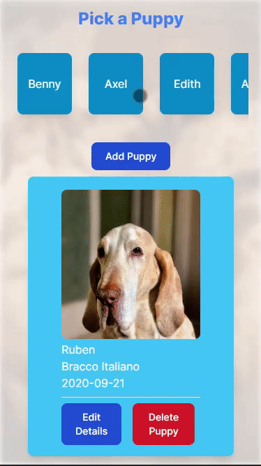

# Puppies Frontend UI

This project is a test of my typescript, react and fullstack skills. It connects to the separate PuppiesAPI repository, which accesses a MongoDB database of "puppies".

The puppy objects consist of a breed, name, birthdate and their assigned id.

The pictures for each card are pulled from the Unsplash API and show pictures relevant to the breed of dog in question. 

The project is mobile-responsive and on smaller screens, one can scroll sideways through the names of all included puppies (as pictured)

 

 
## Scope

Through the UI, one has access to CRUD functions:

- New puppies can be added, which updates the database as well as list of puppies in the UI.

  

- Puppies can be edited or completely changed via the UI.

  

- Puppies can be removed from the database.

## Approach

I wanted the UI to be accessible and clean. I therefore use Modals to ensure that editing and adding new entries was simple, but also unobtrusive during the search.

## Tools

This is a [Next.js](https://nextjs.org/) project bootstrapped with [`create-next-app`](https://github.com/vercel/next.js/tree/canary/packages/create-next-app).

The project is styled with Tailwind CSS and Animated with help from the Framer.Motion library.
